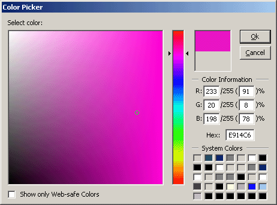



## Color Picker

### Description

It's just a Color picker dialog, some-what similar to the one in Adobe Photoshop. It lets you choose from any of the system colors, as well as display only websafe colors (only works in 32-bit color depth mode). It also uses a memory DC to draw the colors, to make it faster than it would be in VB.
 
### More Info
 

             |
---                |---
**Submitted On**   |2002-03-09 17:22:32
**By**             |[vcv](https://github.com/Planet-Source-Code/PSCIndex/blob/master/ByAuthor/vcv.md)
**Level**          |Intermediate
**User Rating**    |5.0 (20 globes from 4 users)
**Compatibility**  |VB 5\.0, VB 6\.0
**Category**       |[Graphics](https://github.com/Planet-Source-Code/PSCIndex/blob/master/ByCategory/graphics__1-46.md)
**World**          |[Visual Basic](https://github.com/Planet-Source-Code/PSCIndex/blob/master/ByWorld/visual-basic.md)
**Archive File**   |[Color\_Pick60783392002\.zip](https://github.com/Planet-Source-Code/vcv-color-picker__1-32508/archive/master.zip)

